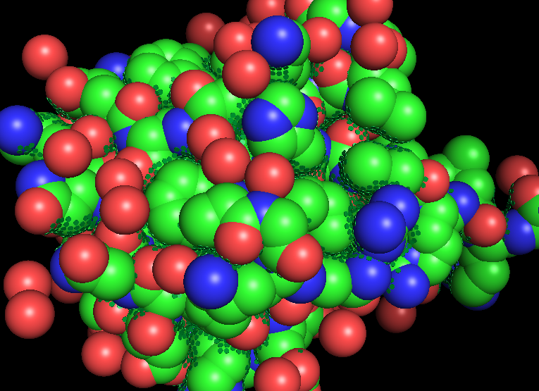

# FIBOS
## Description
The FIBOS package was developed with the objective to offer in Python the Occluded Surface methodology, created by Patrick Fleming and coauthors [Pattabiraman, Ward, & Fleming, 1995].

There is also a version of the FIBOS package implemented as a library for the R language, which can be accessed at: https://github.com/hersonhebert/fibos_r.git
## Functionalities
The package allows the calculation of occluded surface areas between atoms of a molecule, using as input a PDB code or PDB file.
## Requirements

Firstly, it is necessary to have the following packages installed:

    pip install biopython
    pip install numpy
   
Furthermore, the installation of the 'testresources' package is still necessary. To perform the installation, you should use the following command:

For Python 2:
    
    sudo apt install python-testresources

For Python 3:
    
    sudo apt install python3-testresources

Note:

These additional libraries are also required:
 - os
 - shutil
 - pkgutils

Additionally, PyMOL needs to be installed.

## How use
### Installing the Package
    
    pip install git+https://github.com/hersonhebert/fibos_py
    
### Using the Package:
In this beta version, only two functions were implemented: **occluded_surface** and **read_OS**.

The first function is responsible for computing the occluded areas between atoms and returning the results as a tibble/data frame. Additionally, it generates the prot.srf file as a side effect.

Parameters:

  - pdb: this can either be the code or path/file of the PDB that represents a protein. If you wish to obtain the file online from the RCSB PDB site, simply enter the PDB code. If the file is saved locally, enter the file path.

  - method: this parameter determines the method used to calculate the occluded areas between atoms. Accepts the strings "OS" (tradicional) or "FIBOS" (experimental).

The second function read a "prot.srt" file.


## Examples
#### First Example: Calculating Occluded Surfaces:
```
import fibos

def call_occluded(pdb, methodology):
    # Call occluded surface function
    fibos.occluded_surface(pdb, methodology)
if __name__ == '__main__':
    #Call call_occluded function, with 1ubq as PDB file and OS Methodology
    call_occluded("1ubq","OS")
```
##### Output: prot.srf file, raydist.lst file.

#### Second Example: Calculating OSP Value:
```
import fibos

def calc_osp(prot_file):
    # Call respack function
    fibos.respack(prot_file)
    
if __name__ == '__main__':
    #Call calc_osp function, with prot.srf file
    calc_osp("prot.srf")
```
##### Output:


#### Third Example: Generating Dots Visualization:
```
import fibos

def visualize(raydist_file, pdb, type_visualization):
    # Plot
    fibos.pymol_visualize(raydist_file, pdb, type_visualization)

if __name__ == '__main__':
    #Call visualize function, with 1ubq as PDB file and Dots as type visualization
    visualize("raydist.lst","1ubq", "dots")
```
##### Output: 


#### Fourth Example: Generating Rays Visualization
```
import fibos

def visualize(raydist_file, pdb, type_visualization):
    # Plot
    fibos.pymol_visualize(raydist_file, pdb, type_visualization)

if __name__ == '__main__':
    #Call visualize function, with 1ubq as PDB file and Rays as type visualization
    visualize("raydist.lst","1ubq", "rays")
```

##### Output:

## Authors

- Carlos Silveira:  carlos.silveira@unifei.edu.br
- Herson Soares: d2020102075@unifei.edu.br
- João Romanelli: joaoromanelli@unifei.edu.br
- Patrick Fleming: Pat.Fleming@jhu.edu

## References

Pattabiraman, N., Ward, K. B., & Fleming, P. J. (1995). Occluded molecular surface: Analysis of protein packing. Journal of Molecular Recognition, 8, 334–344. https://doi.org/doi.org/10.1002/jmr.300080603

## Status
In Progress.
