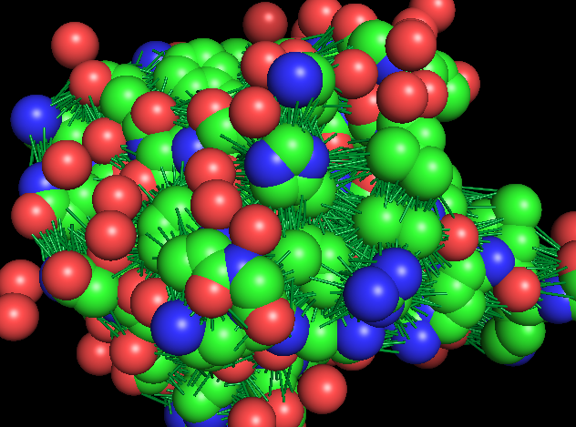
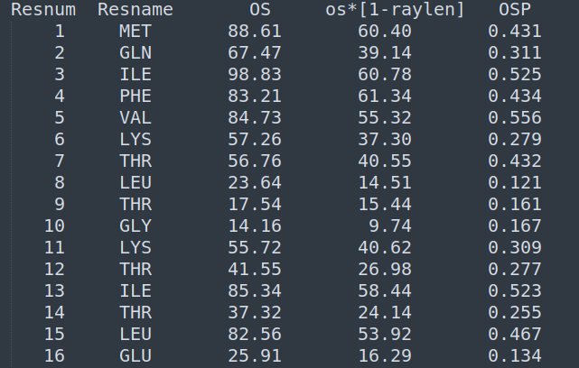

# FIBOS
## Description
The FIBOS package was developed with the objective to offer in R the Occluded Surface methodology, created by Patrick Fleming and coauthors [Pattabiraman, Ward, & Fleming, 1995]
## Functionalities
The package allows the calculation of occluded surface areas between atoms of a molecule, using as input a PDB code or PDB file.
## Requirements

Firstly, it is necessary to have the following packages installed:

    pip install biopython
    pip install numpy
    pip install pymol
Note: These additional libraries are also required:
 - os
 - shutil
 - pkgutils

## How use
### Installing the Package
    
    pip install git+https://github.com/hersonhebert/fibos
    
### Using the Package:
In this beta version, only two functions were implemented: **occluded_surface** and **read_OS**.

The first function is responsible for computing the occluded areas between atoms and returning the results as a tibble/data frame. Additionally, it generates the prot.srf file as a side effect.

Parameters:

  - pdb: this can either be the code or path/file of the PDB that represents a protein. If you wish to obtain the file online from the RCSB PDB site, simply enter the PDB code. If the file is saved locally, enter the file path.

  - method: this parameter determines the method used to calculate the occluded areas between atoms. Accepts the strings "OS" (tradicional) or "FIBOS" (experimental).

The second function read a "prot.srt" file.


## Examples
#### First Example:
```
import fibos

def visualize(pdb, methodology):
    # Call occluded surface function
    fibos.occluded_surface(pdb, methodology)
    # Plot PDB File and Dots
    fibos.disp_dots("raydist.lst", pdb)

if __name__ == '__main__':
    #Call visualize function, with 1ubq as PDB file and OS Methodology
    visualize("1ubq","OS")
```
##### Output:

#### Second Example:
```
import fibos

def visualize(pdb, methodology):
    # Call occluded surface function
    fibos.occluded_surface(pdb, methodology)
    # Plot PDB File and Rays
    fibos.disp_rays("raydist.lst", pdb)

if __name__ == '__main__':
    #Call visualize function, with 1ubq as PDB file and FIBOS Methodology
    visualize("1ubq","FIBOS")
```
##### Output:

#### Third Example:
```
import fibos

def osp_calcule(pdb, methodology):
    # Call occluded surface function
    fibos.occluded_surface(pdb, methodology)
    # Calcule OSP value
    fibos.respak("prot.srf")

if __name__ == '__main__':
    #Call osp_calcule function, with 1ubq as PDB file and FIBOS Methodology
    osp_calcule("1ubq","FIBOS")
```
##### Output:

## Authors

- Herson Soares: d2020102075@unifei.edu.br
- Carlos Silveira:  carlos.silveira@unifei.edu.br
- João Romanelli: joaoromanelli@unifei.edu.br


## References

Pattabiraman, N., Ward, K. B., & Fleming, P. J. (1995). Occluded molecular surface: Analysis of protein packing. Journal of Molecular Recognition, 8, 334–344. https://doi.org/doi.org/10.1002/jmr.300080603

## Status
In Progress.
